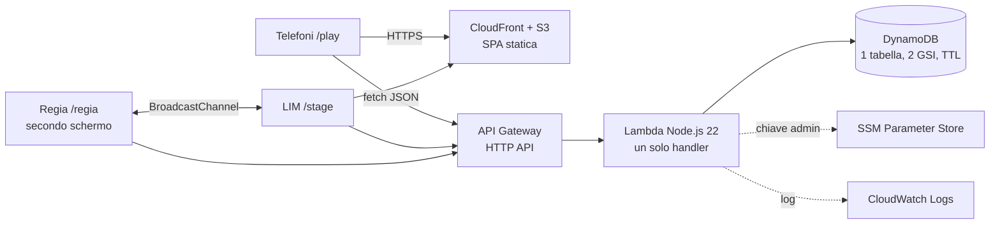

# DynamoLive

> **Branch `prod`** · versione per AWS: senza DynamoDB Local né server locale, con gli script `scripts/deploy-aws.ps1` e `scripts/new-session-aws.ps1`. Per la demo locale usa il branch `develop`.

**Presentazione interattiva su Amazon DynamoDB: il pubblico entra nel database con il telefono.**

Durante il talk (15 minuti, due speaker) le persone in sala aprono un QR, scelgono un nome e giocano a due giochi:

- **Pixel Wall**: accendono insieme il logo di DynamoDB, un pixel alla volta. Ogni pixel è una scrittura condizionale; due persone sulla stessa cella → vince la prima, senza lock.
- **HOT KEY**: arancione contro viola, 15 secondi di tap. Tutti aggiornano gli stessi contatori: una *hot key* resa visibile.

Gli esempi delle slide sono i dati appena scritti dal pubblico: l'item del pixel, il giocatore che l'ha acceso, la classifica letta da un indice, il costo reale in capacità consumata, il TTL che farà scadere tutto.

## Architettura in breve



Un solo codice gira in tre modi, scelti **solo da configurazione**:

| Modo | Database | API | Per cosa |
| --- | --- | --- | --- |
| Locale | DynamoDB Local (Docker) | Node sul portatile | sviluppo, prove, piano B offline |
| AWS | DynamoDB | API Gateway + Lambda | presentazione reale |
| Mock / statico | nel browser / nessuno | nessuna | prove dell'interfaccia, emergenza senza rete |

Dettagli in [docs/architecture.md](docs/architecture.md).

## Tecnologie

- **Frontend**: Svelte 5 + TypeScript, Vite, GSAP; tre viste (`/stage` LIM, `/regia` presentatore, `/play` telefoni).
- **Backend**: TypeScript, AWS SDK v3, un handler Lambda con router interno (lo stesso gira come server Node in locale).
- **Dati**: una tabella DynamoDB (single-table design), GSI `ByTime` e `ByScore`, transazioni, scritture condizionali, TTL.
- **Infrastruttura**: AWS SAM (CloudFormation) in [`infra/template.yaml`](infra/template.yaml).
- **Locale**: DynamoDB Local in Docker ([`compose.yaml`](compose.yaml)).

## Branch

| Branch | Contenuto | Quando usarlo |
| --- | --- | --- |
| `main` | Versione stabile e presentabile: codice, documentazione, infrastruttura. Nessuna configurazione personale né segreti. | Leggere, presentare, partire per nuove modifiche |
| `develop` | `main` + comodità per la demo locale (avvio con un comando, configurazione dell'app Claude). | Sviluppo e demo senza AWS (piano B) |
| `prod` | `main` senza gli emulatori locali + script di deploy e di gestione su AWS. | Deploy e uso reale su AWS |

Il codice applicativo è lo **stesso** nei tre branch: cambiano solo strumenti e configurazione. Le modifiche comuni nascono su `main` e da lì si portano in `develop` e `prod` con una merge. Motivazioni in [docs/architecture.md](docs/architecture.md#branch-e-ambienti).

## Demo locale (senza AWS)

Servono Node.js 22+, npm e Docker Desktop.

```powershell
npm ci
npm --prefix frontend ci
Copy-Item .env.example .env                                           # solo se .env non esiste
Copy-Item frontend/.env.development.example frontend/.env.development # solo se non esiste
docker compose up -d
npm run seed -- --sid demo-01
npm run dev:api                      # terminale 1
npm --prefix frontend run dev        # terminale 2
```

Aprire `http://localhost:5173/stage?s=demo-01` sulla LIM, premere **R** per aprire la regia e incollare la chiave admin di `.env`. Sul branch `develop` basta `./scripts/demo-local.ps1`. Guida completa (anche telefoni in LAN e modalità senza backend): [docs/demo-guide.md](docs/demo-guide.md).

## Ambiente AWS (production)

Sul branch `prod`:

```powershell
./scripts/deploy-aws.ps1 -Environment live -Profile live   # stack, frontend su S3/CloudFront
./scripts/new-session-aws.ps1 -Environment live -Profile live -Sid talk-01
```

La chiave admin vive in SSM Parameter Store, non nel codice né nelle variabili della Lambda. Preparazione dell'account da zero, IAM, costi e CORS: [docs/aws-setup.md](docs/aws-setup.md).

## Documentazione

| Documento | Contenuto |
| --- | --- |
| [architecture.md](docs/architecture.md) | Componenti, modello dati, flussi, scelte e compromessi, branch |
| [aws-setup.md](docs/aws-setup.md) | Configurazione AWS da zero: account, IAM, CLI, SSM, deploy, costi |
| [demo-guide.md](docs/demo-guide.md) | Avvio locale, viste, regia, scorciatoie, modalità mock e statica |
| [presentation-script.md](docs/presentation-script.md) | Copione a due voci, speaker notes, domande del docente |
| [presentation-checklist.md](docs/presentation-checklist.md) | Controlli prima della presentazione |
| [troubleshooting.md](docs/troubleshooting.md) | Piano B e soluzione dei problemi |
| [riferimento/](docs/riferimento/) | Specifica dei giochi, contratto API, design della presentazione |
| [contenuti/](docs/contenuti/) | Documento di approfondimento per il pubblico (Markdown e PDF) |
| [archivio/](docs/archivio/) | Documenti di lavoro superati, conservati per storia |

## Verifiche

```powershell
npm run typecheck; npm test                      # backend: tipi e test unitari
npm run test:integration                         # backend su DynamoDB Local (serve Docker)
npm --prefix frontend run typecheck; npm --prefix frontend test
npm run build:backend; npm --prefix frontend run build:live
```
