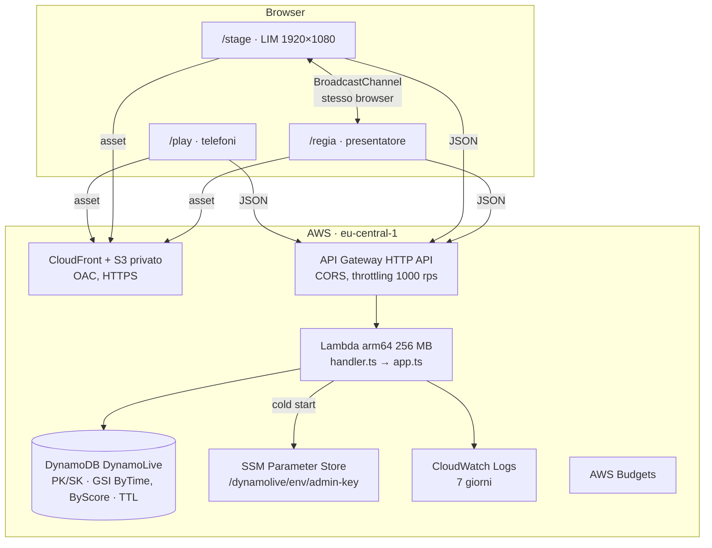
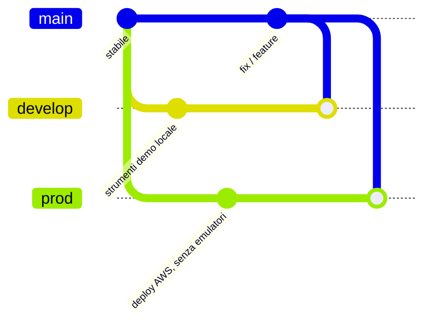

# Architettura

DynamoLive è una single-page app servita come file statici e un'API serverless davanti a **una sola tabella DynamoDB**. Questo documento spiega componenti, dati, flussi, compromessi e come lo stesso codice gira in locale e su AWS.

## Componenti

| Parte | File | Responsabilità |
| --- | --- | --- |
| Router applicativo | `backend/src/app.ts` | Tutte le rotte `/s/{sid}/...`, validazione, CORS applicativo, errori uniformi |
| Dominio | `backend/src/lib/domain.ts` | Validazioni, stato iniziale, transizioni di fase, chiavi |
| Accesso ai dati | `backend/src/lib/ddb.ts` | Client DynamoDB, paginazione, misura della capacità consumata (X-Ray e tassametro) |
| Configurazione | `backend/src/lib/config.ts` | Variabili d'ambiente; chiave admin da env (locale) o da SSM (AWS) |
| Adattatore AWS | `backend/src/handler.ts` | Evento API Gateway v2 → `app`; configurazione caricata una volta per container |
| Adattatore locale | `backend/local-server.ts` | Server Node HTTP → lo stesso `app` |
| Tipi condivisi | `shared/types.ts` | Contratto tra frontend e backend |
| Frontend | `frontend/src` | `stage/` (scene), `regia/` (console), `play/` (telefono), `shared/` (API, sync tela, config) |
| Infrastruttura | `infra/template.yaml` | Tabella, Lambda, HTTP API, S3, CloudFront, log, budget, permessi |

### Servizi astratti, implementazioni intercambiabili

Il punto di sostituzione è uno solo per lato, così non serve duplicare codice:

- **Backend → database**: `newClient(config)` crea il client DynamoDB. Con `DDB_ENDPOINT` parla con DynamoDB Local, senza parla con DynamoDB vero. Il resto del codice non sa quale sia.
- **Backend → segreti**: `loadConfiguration()` usa `ADMIN_KEY` se presente (locale), altrimenti legge il parametro indicato da `ADMIN_KEY_PARAMETER` da SSM (AWS).
- **Backend → HTTP**: `createApp()` riceve una richiesta neutra; `handler.ts` (Lambda) e `local-server.ts` (Node) sono solo adattatori.
- **Frontend → API**: `Api.call()` usa `fetch` verso `VITE_API_BASE`, oppure un `transport` alternativo: `mock.ts` (database finto in `localStorage`, `?mode=mock`). La modalità statica (`?mode=static`) non chiama nulla e mostra dati d'esempio dichiarati.

Una soluzione con interfacce e classi "MockService/AwsService" separate sarebbe stata più lunga e più rischiosa a ridosso della presentazione: il comportamento di DynamoDB Local è già quello reale (stesse API, stesse condizioni, stesse transazioni), quindi l'emulatore è un'implementazione migliore di qualsiasi mock scritto a mano.

## Modello dati (single-table)

Tabella con chiave `PK` (partition) + `SK` (sort), TTL sull'attributo `expiresAt` (epoch secondi). Il TTL non è una proprietà della tabella ma **di ogni item**, e la presentazione si appoggia proprio a questo: gli item di sessione vivono 24 h, quelli della tela scadono uno per volta durante la scena finale (vedi *Chiusura*).

| Entità | PK | SK | Attributi principali |
| --- | --- | --- | --- |
| Stato sessione | `SESSION#<sid>` | `META` | `phase`, `version`, timer, `roundId`, flag |
| Contatori | `SESSION#<sid>` | `STATS` | giocatori, pixel, conflitti, tap per squadra, capacità consumata |
| Giocatore | `SESSION#<sid>` | `PLAYER#<pid>` | `nickname`, `team`, `score`, `lastSeq`, `lb`, `lastPixelAt` |
| Pixel | `CANVAS#<sid>` | `PX#<xxx>#<yyy>` | `color`, `by`, `byId`, `cv`, `updatedAt`, `expiresAt` individuale |

| Indice | Chiavi | Serve per |
| --- | --- | --- |
| `ByTime` | `cv` + `updatedAt` | "Cosa è cambiato sulla tela dopo t?" (solo i pixel hanno `cv`: indice *sparse*) |
| `ByScore` | `lb` (= `sid#roundId`) + `score` | Classifica del round già ordinata (solo chi ha tappato ha `lb`) |

Le coordinate hanno gli zeri (`PX#012#005`) perché le sort key si ordinano come stringhe.

## Flussi principali

**Pixel.** Una `TransactWriteItems` con quattro elementi: controllo che la fase non sia cambiata (`META.version`), cooldown sul giocatore, `Put` del pixel con `attribute_not_exists(PK)` (vince il primo), incremento di `STATS`. Se fallisce solo la condizione del pixel la risposta è `409 PIXEL_TAKEN` e il telefono prova un'altra cella.

**Tap (HOT KEY).** Il telefono accoda i tap e invia batch seriali `{seq, delta}`. La transazione aggiorna `PLAYER` (punteggio, `lastSeq`) e `STATS` (totale squadra). Un batch ripetuto con lo stesso `seq` viene riconosciuto come duplicato: niente punti doppi dopo una risposta persa. Limite anti-abuso: 12 tap ogni 500 ms.

**Fasi.** `lobby → pixel → pixel_frozen → talk → hotkey_ready → hotkey_running → hotkey_end → end`, solo in avanti, con controllo di versione (optimistic locking). Le scene della LIM possono andare avanti e indietro, la fase del database no.

**Chiusura (TTL).** Entrare in fase `end` accorcia `META.canvasExpiresAt` a `now + endTtlMs` (60 s di default) e riscrive ogni item della tela con un `expiresAt` **proprio**, distribuito uniformemente sulla finestra nell'ordine in cui il pubblico ha acceso le celle. `updatedAt` resta invariato, così la riscrittura non appare come una nuova accensione nel feed `ByTime`. Da lì in poi il filtro che backend e pagine applicavano da sempre («ignora gli item scaduti») fa sparire i pallini uno alla volta mentre lo speaker parla. La cancellazione fisica da parte di AWS resta asincrona e gratuita: quello che si vede è la scadenza *logica*, e va detto. Se la riscrittura riesce solo in parte la fase avanza lo stesso e la regia può riapplicarla con `POST /admin/dissolve`.

**Sincronizzazione.** Nessun WebSocket: polling (META 1 s, tela 0,4–0,5 s con delta da `ByTime`, snapshot completo ogni 15 s). La tela è interrogata a quel ritmo solo quando può cambiare (gioco Pixel Wall e dissolvenza finale); nelle altre fasi LIM e regia la rileggono ogni 3 s, e subito a ogni cambio di fase. La regia non chiede la classifica e legge `STATS` ogni 3 s. Più semplice da spiegare, da far funzionare dietro qualsiasi rete e da stimare nei costi. Ogni pixel viaggia con il proprio `expiresAt`, così la dissolvenza finale è fluida fra un polling e l'altro invece di procedere a scatti.

**Orologi.** Il client corregge il proprio orologio dal punto medio richiesta/risposta e da `serverTime`. Due orologi quindi convivono in pagina: quello **corretto** per tutto ciò che il backend timbra (fine fase, fine round, TTL) e quello **locale** per ciò che si misura dentro il browser (da quanto tace l'altra finestra). Confonderli è un errore già costato una regressione: la regia dava la LIM per scollegata solo perché il portatile era indietro di qualche secondo rispetto ad AWS.

## Sicurezza

- **Chiave admin**: su AWS è un `SecureString` in SSM, letta dalla Lambda al cold start. Non è nel codice, non è nel bundle del frontend, non è una variabile della Lambda. Il presentatore la incolla in regia; resta in `sessionStorage` di quella scheda.
- **Giocatori**: il telefono conosce solo il proprio `pid`, inviato come `x-player-id` per leggere i propri dati.
- **CORS**: API Gateway e l'app accettano solo le origini configurate (in `live` solo il dominio CloudFront).
- **Minimo privilegio**: il ruolo della Lambda può solo `GetItem/PutItem/UpdateItem/DeleteItem/Query/ConditionCheckItem` sulla tabella e i suoi indici, leggere un solo parametro SSM e `cloudwatch:GetMetricData` (sola lettura, senza condizioni per risorsa: l'azione non le supporta).
- **Input**: nickname validati e filtrati, corpo max 16 KB, sid e pid con formato fisso, nessun dettaglio AWS negli errori o nei log.

## Compromessi dichiarati

- `STATS` è un'unica hot key scelta apposta per la didattica: alla scala del talk va bene, a scala grande servirebbe *write sharding* o un'aggregazione asincrona (Streams).
- La classifica durante il round legge il GSI (eventualmente consistente); a round finito si rilegge la tabella con lettura forte.
- Il tassametro è una **stima a listino**: capacità realmente consumata (`ReturnConsumedCapacity`) moltiplicata per i prezzi pubblicati, non una fattura. Le quantità sono misurate, il prezzo è di listino, e mancano free tier, crediti e imposte.
- Il contatore ha **due voci**: il pubblico (richieste senza chiave admin) e LIM e regia (tutto il resto, comprese le scritture del contatore stesso). Il polling di LIM e regia è traffico della presentazione, non del servizio: la proiezione ×1.000 e ×1.000.000 moltiplica solo il pubblico. Il polling dei telefoni resta nella voce del pubblico, perché cresce davvero con le persone.
- Il contatore dell'app è bufferizzato per container Lambda (una scrittura in più per richiesta costerebbe più della richiesta stessa): un container che non riceve altre richieste perde quel poco che non aveva ancora scaricato, quindi il totale dell'app tende a essere **leggermente inferiore** al vero. `GET /admin/aws` rilegge le stesse grandezze da CloudWatch come controllo — misurate da AWS, con 1–3 minuti di ritardo e riferite alla tabella e alla funzione, non alla singola sessione.
- Nessun WebSocket, nessuna autenticazione utente: fuori scopo per una sessione di 15 minuti con dati che scadono in 24 h.

## Branch e ambienti

| | `develop` | `main` | `prod` |
| --- | --- | --- | --- |
| Codice applicativo | uguale | uguale | uguale |
| DynamoDB Local, seed, server Node, test di integrazione | sì | sì | rimossi |
| Avvio demo con un comando (`scripts/demo-local.ps1`) | sì | no | no |
| Script di deploy e sessioni AWS | no | no | sì |
| Documentazione | ereditata | **fonte** | ereditata |

**Perché tre branch con lo stesso codice e non tre codici diversi.** Le differenze tra locale e AWS sono tutte in configurazione (`DDB_ENDPOINT`, `ADMIN_KEY`/`ADMIN_KEY_PARAMETER`, `VITE_API_BASE`). Se i branch divergessero nel codice, ogni correzione andrebbe riportata a mano tre volte e la demo locale (il piano B) smetterebbe presto di essere affidabile. Così i branch differiscono solo per strumenti: `develop` aggiunge comodità locali, `prod` toglie gli emulatori e aggiunge il deploy.

**Flusso di lavoro.** `main` è la base comune; `develop` e `prod` sono branch di ambiente che la seguono.

1. Le modifiche comuni (codice, documentazione) si fanno su `main`, direttamente o con un branch di feature.
2. Poi si porta `main` negli ambienti: `git checkout develop; git merge main` e `git checkout prod; git merge main`.
3. `develop` e `prod` **non** si mergiano in `main`: porterebbero dentro i loro file specifici. Se una modifica nasce su `develop` durante una prova, si porta su `main` con `git cherry-pick <commit>`.
4. Se una merge in `prod` tocca un file che lì è stato rimosso (per esempio `compose.yaml`), si conferma la rimozione con `git rm <file>` e si completa la merge.
