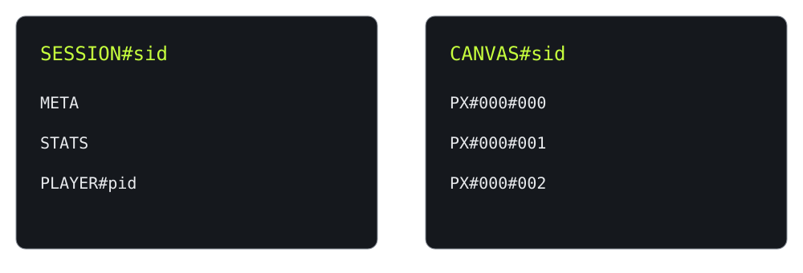
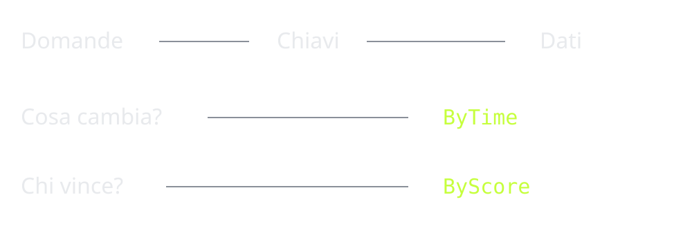

# DynamoLive
## Siete già nel database

Una guida ad Amazon DynamoDB attraverso Pixel Wall e HOT KEY.

Edizione del 21 settembre 2026 · Contratto applicativo v1

Questo documento accompagna una presentazione di quindici minuti. Nel primo gioco ogni partecipante colora una cella; nel secondo accumula punti per sé e per la squadra. I dati prodotti dal pubblico diventano gli esempi con cui leggere chiavi, indici, condizioni e costi.

La domanda centrale non è «quante tabelle mi servono?», ma «quali risposte devo ottenere, con quale latenza e a quale scala?». DynamoDB permette di progettare un percorso breve dalla domanda ai dati, spostando buona parte del lavoro nella modellazione iniziale.

### Come leggere la guida

Le prime pagine spiegano modello e operazioni. Il caso di studio mostra le scelte effettive della demo, comprese le semplificazioni. Le ultime pagine trattano affidabilità, costi e criteri di scelta. I riferimenti numerati rimandano alle fonti primarie in appendice.

La demo non misura la capacità massima di DynamoDB. La modalità mock, il fallback statico e i moltiplicatori economici sono esempi dichiarati. Le misure dell'Inspector provengono dal backend reale soltanto quando si usa la modalità API.

### Indice

1. Perché esiste
2. Modello dati
3. Progettare per access pattern
4. Il caso DynamoLive
5. API e correttezza
6. Scalabilità e affidabilità
7. Costi, scelta e casi d'uso
8. Glossario e laboratorio
9. Fonti e verifiche

Il PDF di ricerca iniziale citato nei documenti di progetto non è presente nel repository. Questa guida è una stesura autonoma basata sul codice, sul contratto e sulle fonti indicate. La revisione del proprietario del backend è ancora da svolgere.

<!-- page -->
# 1. Perché esiste

### 1.1 Dalla crescita dei servizi al problema dei dati

Un carrello deve continuare ad accettare operazioni mentre il traffico cresce o alcuni componenti sono indisponibili. Il paper Dynamo descrive il problema nel contesto dei servizi Amazon: disponibilità, distribuzione e gestione dei conflitti sono scelte esplicite del sistema. Il servizio che usa lo storage partecipa alla definizione della correttezza. [1]

La slide «Natale 2004» è una cornice narrativa ripresa dal progetto. Non attribuiamo al grafico un andamento storico misurato e non presentiamo un preciso incidente del 2004 come fatto verificato: le fonti raccolte qui non lo documentano. Il grafico è etichettato come illustrazione.

### 1.2 Dynamo non è DynamoDB

Dynamo è il sistema descritto nel paper SOSP del 2007. Fra le tecniche discusse ci sono consistent hashing, replica, versionamento e riconciliazione. Quel paper è una fonte storica, non il manuale operativo dell'attuale servizio AWS. Non si devono trasferire automaticamente a DynamoDB tutte le garanzie o i dettagli implementativi di Dynamo. [1]

DynamoDB viene annunciato il 18 gennaio 2012 come servizio NoSQL gestito. La continuità del nome non rende identiche le due architetture. Per progettare un'applicazione odierna, le API e le garanzie documentate del servizio sono il riferimento. [2]

### 1.3 Che cosa compriamo

DynamoDB è un servizio proprietario AWS per dati key-value e documentali. L'utente sceglie chiavi, attributi, indici e politiche operative; AWS gestisce l'infrastruttura del database. «Serverless» significa che non amministriamo server del database: restano da progettare applicazione, autorizzazioni, capacità e osservabilità. DynamoDB Local è uno strumento di sviluppo, non un servizio di produzione equivalente. [3]

Nella demo una sola Lambda espone le API e una sola tabella contiene le entità della sessione. Il browser esegue polling: le richieste sono periodiche, non un flusso WebSocket. La regia modifica META e i telefoni osservano il nuovo stato. Questa semplicità operativa lascia visibili le decisioni sul modello dati.

### Domanda di controllo

Se DynamoDB gestisce i server, chi decide che cosa accade quando il telefono ritenta una richiesta? L'applicazione: la disponibilità dell'infrastruttura non sostituisce il protocollo di idempotenza.

<!-- page -->
# 2. Modello dati

### 2.1 Tabella, item, attributi

La tabella contiene item identificati univocamente. Gli item hanno attributi; quelli non chiave possono variare fra entità. Una tabella appartiene a un account e a una regione: non serve creare un contenitore «database» come nei comuni flussi SQL. Schema flessibile non significa assenza di regole: il contratto applicativo stabilisce comunque campi, tipi e validazioni. [3]

Una primary key semplice contiene solo la partition key. Una chiave composta aggiunge la sort key. I valori chiave utilizzano tipi scalari String, Number o Binary. Nella demo PK e SK sono stringhe. L'identità di un pixel è la coppia CANVAS#sid e PX#012#007; le coordinate usano zero-padding per preservare l'ordine desiderato.

### 2.2 Gruppo logico e partizione fisica

DynamoDB usa il valore della partition key come input a una funzione hash per il collocamento. La sort key ordina gli item nel gruppo; le stringhe sono ordinate secondo i byte UTF-8. Timestamp ISO-8601 ordinano come atteso solo con formato e fuso coerenti. Numeri memorizzati come numeri seguono l'ordine numerico. AWS gestisce la suddivisione e la distribuzione delle partizioni. [4]

Questo disegno mostra gruppi logici, non server né partizioni fisiche visibili. Tutti i giocatori condividono SESSION#sid; tutti i pixel condividono CANVAS#sid. Sort key differenti non provano che le scritture siano distribuite su partizioni differenti. L'hash che assegna la squadra è un calcolo dell'applicazione, distinto dall'hash di partizionamento DynamoDB.

### 2.3 Limiti da progettare prima

Un item non supera 400 KB, nomi degli attributi inclusi. La partition key arriva a 2048 byte e la sort key a 1024 byte. Con LSI, una item collection ha un limite di 10 GB. Questi vincoli non sono inviti a usare item enormi: dimensione e arrotondamenti influiscono sul costo. [5]

Cambiare la chiave di un'entità significa creare un item sotto una nuova identità e rimuovere quello vecchio, con un protocollo coerente. Non è un normale aggiornamento di attributo. Nel progetto il prefisso della sort key distingue META, STATS e PLAYER, rendendo espliciti i percorsi di lettura.

<!-- page -->
# 3. Progettare per access pattern

### 3.1 Partire dalle domande

Una domanda utile ha parametri, frequenza, volume e requisiti di consistenza: «dammi i primi dieci punteggi di questo round» è più precisa di «fammi una classifica». Le chiavi e gli indici si scelgono per rispondere a quelle domande senza visitare dati estranei.

Il contrasto con SQL è didattico: anche un relazionale richiede progettazione e indici. DynamoDB rende particolarmente esplicita la relazione fra chiavi e accessi efficienti. Una nuova domanda può richiedere un nuovo indice, attributi derivati o un'altra struttura dei dati.

### 3.2 Single-table design

Entità diverse possono convivere nella stessa tabella. In un esempio e-commerce, PK=USER#42 e SK=PROFILE identifica il profilo, mentre SK=ORDER#2026-09-21#001 identifica un ordine dello stesso utente. Una Query per quella PK può raccogliere le entità utili a una schermata. Questo è un esempio progettuale, non uno schema universale.

### 3.3 GSI, LSI e indice sparse

Un GSI offre chiavi e proiezioni alternative. La lettura dell'indice restituisce gli attributi proiettati; non recupera automaticamente gli altri dalla tabella. Le chiavi dell'indice non devono essere univoche. La propagazione è asincrona. Un item privo degli attributi chiave del GSI non vi compare: da qui l'uso di indici sparse. [6]

Un LSI mantiene la partition key della tabella e permette un'altra sort key. Va definito alla creazione della tabella, supporta letture forti e condivide il vincolo della item collection. Il progetto usa GSI, non LSI. [7]

### 3.4 Hot key e hot partition

Una hot key riceve molte operazioni sullo stesso item; una hot partition concentra troppo traffico su una partizione. Il write sharding divide un contatore in più chiavi e richiede aggregazione in lettura. Distribuire il traffico aumenta le possibilità di scala, ma aggiunge complessità. La capacità per partizione e le dimensioni degli item restano vincoli anche in on-demand. [8]

Nel nostro caso STATS viene toccato da molte transazioni. È una scelta accettabile per decine di partecipanti, non la dimostrazione di un design per milioni. Una soluzione con Streams sarebbe un'evoluzione da progettare, non una funzionalità già presente.

<!-- page -->
# 4. Il caso DynamoLive

### 4.1 Una tabella, quattro entità

| Entità | Partition key | Sort key | Scopo |
| --- | --- | --- | --- |
| META | SESSION#sid | META | Fase, timer, versione |
| STATS | SESSION#sid | STATS | Totali e telemetria |
| PLAYER | SESSION#sid | PLAYER#pid | Identità, squadra, punti |
| PIXEL | CANVAS#sid | PX#xxx#yyy | Stato della cella |

La sessione isola una prova. Il server genera il pid al join: nel progetto funziona da credenziale bearer. Il telefono lo conserva per la sessione e l'ambiente scelti. Lo stage usa una chiave admin in header, mai incorporata nella build.

### 4.2 Le domande implementate

META e item singoli vengono letti con GetItem. La lobby usa Query sul prefisso PLAYER#. La tela completa usa Query sulla PK della canvas. ByTime ha cv come partition key e updatedAt come sort key. ByScore ha lb come partition key e score come sort key; lb identifica sessione e round, nella forma sid#roundId.

Il GSI ByTime contiene l'ultimo stato delle celle, non tutti gli eventi. Non permette di ricostruire un time-lapse storico. Il client applica soltanto timestamp più recenti, conserva le tombstone e usa il cursore restituito dal server. Ogni quindici secondi e alla riconnessione richiede comunque uno snapshot completo.

### 4.3 Correttezza dei giochi

Pixel Wall combina controllo di META, cooldown del giocatore, pixel e conteggio in una transazione. Un errore non deve consumare il cooldown lasciando il pixel non scritto. Il client mostra un'anteprima semitrasparente e la rimuove quando arriva la risposta.

HOT KEY combina punteggio individuale e totali in una transazione. Ogni batch contiene roundId, seq e delta; in caso di risposta persa si ritenta esattamente lo stesso batch. I nuovi tap restano in coda. Un solo batch per telefono può essere in volo. Il limite applicativo è dodici tap per batch da mezzo secondo.

### 4.4 Fine round e compromessi

Il bottone si blocca alla scadenza server. Il backend ammette una grace di due secondi per batch pendenti. La classifica finale legge i giocatori dalla tabella con consistenza forte e resta provvisoria finché termina la grace. La finestra non prova quando è avvenuto un tap remoto: è un compromesso dichiarato.

Solo la telemetria economica usa un buffer Lambda; i punti non dipendono da quel buffer. Gli item scadono logicamente ventiquattro ore dalla creazione della sessione. Moderazione, hide e ban fanno parte del flusso applicativo, non sono proprietà automatiche del database.

<!-- page -->
# 5. API e correttezza

### 5.1 Operazioni fondamentali

PutItem crea o sostituisce un item; GetItem legge una chiave; UpdateItem modifica attributi; DeleteItem rimuove l'item. Una condizione può subordinare l'operazione allo stato esistente. Un contatore atomico evita il ciclo fragile «leggi, incrementa sul client, riscrivi», ma da solo non rende sicuro un retry: ripetere un incremento può contare due volte.

La demo aggiunge un numero di sequenza al protocollo. Il client persiste il batch prima dell'invio e lo elimina solo dopo conferma. Un rifiuto di autorizzazione interrompe i retry; un errore transitorio mantiene lo stesso payload. Non si deve trasformare un timeout in un nuovo evento di gioco.

### 5.2 Query contro Scan

Query seleziona una partition key e può restringere la sort key. Scan attraversa gli item dell'insieme letto. Una FilterExpression scarta risultati dopo la lettura, non crea un accesso indicizzato. Risultati grandi richiedono paginazione; «ho ricevuto pochi item» non dimostra che la lettura abbia consumato poca capacità. [9]

Nella demo la classifica è una domanda nota: viene preparato ByScore. Una scansione generale a ogni aggiornamento del maxischermo renderebbe il consumo dipendente da dati che non interessano al round.

### 5.3 Batch e transazioni

BatchGetItem ammette fino a cento item e sedici MB; BatchWriteItem fino a venticinque put/delete e sedici MB. Sono limiti diversi da quelli delle transazioni, e vanno gestiti gli elementi non elaborati. Non chiamare un batch «transazione» solo perché contiene più operazioni. [5]

TransactWriteItems coordina fino a cento item distinti con un totale fino a quattro MB. Le azioni sono atomiche nel perimetro supportato: successo complessivo o nessuna scrittura. Condizioni e conflitti possono causare annullamento; retry e idempotenza vanno progettati. Le transazioni hanno un costo maggiore delle operazioni standard. [10]

### 5.4 PartiQL e sviluppo locale

PartiQL espone un sottoinsieme di sintassi compatibile SQL per le operazioni DynamoDB. Non trasforma il servizio in un motore relazionale generalista: la forma della query continua a determinare il percorso di accesso. L'aspetto SQL non elimina il rischio di una scansione. [11]

Per il laboratorio non servono account AWS: DynamoDB Local e il wrapper HTTP riusano il backend. Il comando docker compose up -d usa la configurazione del repository. Le istruzioni Windows con Java portatile sono nella guida tecnica. Non usare la modalità mock come prova di prestazioni, IAM, transazioni o tempi di convergenza reali.

<!-- page -->
# 6. Scalabilità e affidabilità

### 6.1 Capacità e consistenza

Una RCU copre una lettura forte al secondo fino a quattro KB, oppure due eventuali; una WCU una scrittura al secondo fino a un KB. Le transazioni richiedono più unità. On-demand usa unità di richiesta anziché capacità prenotata. Le dimensioni vengono arrotondate secondo l'operazione. [5]

Come riferimento di progetto, una partizione è dimensionata per tremila unità di lettura e mille di scrittura al secondo. Item più grandi consumano più unità per operazione. Questi numeri non sono la capacità totale della tabella e non garantiscono il throughput di una hot key nel nostro carico transazionale. [8]

Le letture della tabella e degli LSI possono essere forti; quelle dei GSI sono eventuali. Un aggiornamento appena confermato può non essere ancora visibile nell'indice. Forte non significa che un'altra scrittura non possa avvenire subito dopo la lettura. [12]

### 6.2 Regione e Global Tables

AWS replica i dati su tre Availability Zone nella regione. Le Global Tables estendono la replica a più regioni. MREC propaga gli aggiornamenti in modo eventuale; MRSC fornisce consistenza forte multi-regione nelle configurazioni supportate. MRSC richiede una topologia prevista da AWS e non supporta TTL; non si abilita quindi come sostituzione trasparente del modello di questa demo. [13,14]

Lo SLA distingue 99,99% standard e 99,999% Global Tables, alle condizioni contrattuali. Non è corretto attribuire i cinque nove esclusivamente a MRSC, né promettere lo stesso SLA all'intera app sommando servizi. [15]

### 6.3 Recupero, cache ed eventi

RPO indica quanti dati si accetta di perdere; RTO quanto tempo si accetta di restare indisponibili. Dipendono dalla strategia completa, dalle dipendenze e dalle prove di recupero. Una replica non sostituisce un backup contro cancellazioni applicative.

PITR conserva punti di recupero fino a trentacinque giorni, con periodo configurabile. Il ripristino crea una tabella distinta. Backup on-demand e prove di restore completano la strategia. [16]

DAX è una cache in memoria per accelerare letture compatibili: aggiunge un componente e non risolve il protocollo dei tap. DynamoDB Streams conserva modifiche ordinate per item per ventiquattro ore e può alimentare consumer come Lambda. Un aggregatore deve gestire duplicati e recupero. Nessuno dei due servizi è usato nell'MVP. [17,18]

<!-- page -->
# 7. Costi, scelta e casi d'uso

### 7.1 Leggere lo scontrino

L'Inspector mostra capacità restituite dall'SDK e tempo osservato nelle chiamate al database. Il tempo residuo fra totale client e misura DB comprende più componenti: non è una misura pura della rete. Il feed degli eventi è ricostruito dalle letture e può omettere aggiornamenti intermedi.

Il tassametro usa i parametri regionali condivisi dal backend: WRU, RRU, richieste HTTP API, richieste Lambda e durata osservata a 256 MB. Include separatamente tabella e GSI. Una scrittura indicizzata non costa sempre «il doppio»: dipende da operazione, dimensioni e modifica dell'indice.

La telemetria può perdere la coda di un container. La stima non è una fattura: esclude storage, hosting, log, trasferimenti, crediti e imposte. Su Local o DEV provisioned rappresenta l'equivalente a listino on-demand. I moltiplicatori applicano una proiezione lineare, senza generare traffico e senza modellare gli scaglioni. I prezzi di Francoforte sono registrati in shared/pricing.ts e shared/pricing-sources.json.

### 7.2 Quando sì e quando no

DynamoDB è un candidato quando gli accessi sono definiti, le entità hanno chiavi utili e l'applicazione beneficia di un servizio gestito con capacità elastica. Sessioni, carrelli e punteggi sono esempi progettuali; per telemetria e serie temporali occorre definire anche finestre, retention e query. Non basta che un dato «sia JSON».

Query esplorative, analytics e relazioni che cambiano spesso possono favorire altri strumenti. Denormalizzazione, indici e protocolli aggiungono lavoro; lock-in e costi di accessi inefficienti vanno valutati. Il single-table design è una tecnica, non un obbligo.

CAP riguarda il comportamento durante una partizione di rete; ACID descrive proprietà delle transazioni. Sono assi diversi. Poiché il servizio offre letture con consistenze diverse e transazioni, le etichette rigide «NoSQL=BASE» e «SQL=ACID» non spiegano le scelte applicative.

### 7.3 Un caso reale verificato

AWS riporta per Prime Day 2025 un picco DynamoDB di 151 milioni di richieste al secondo. È una misura pubblicata del servizio nell'evento, non il risultato della nostra tabella né una promessa per lo stesso schema dati. Non aggiungiamo loghi di aziende senza un caso primario verificato. [19]

### 7.4 Il ricordo e il TTL

expiresAt contiene secondi Unix. Il countdown indica scadenza logica; AWS elimina fisicamente gli item in modo asincrono, tipicamente entro alcuni giorni. Gli item in attesa possono essere ancora letti: l'app li deve filtrare. In DynamoLive il conto parte dalla creazione della sessione, non dalla slide finale. [20]

<!-- page -->
# 8. Glossario e laboratorio

### 8.1 Le sigle da tenere vicine

| Sigla | Significato operativo |
| --- | --- |
| PK / SK | Partition key / sort key |
| RCU / WCU | Capacità di lettura / scrittura al secondo |
| RRU / WRU | Unità di richiesta in on-demand |
| GSI / LSI | Indice secondario globale / locale |
| MREC / MRSC | Consistenza multi-regione eventuale / forte |
| RPO / RTO | Perdita dati / durata indisponibilità accettabili |
| DAX | Cache gestita per DynamoDB |
| TTL | Scadenza per item con rimozione asincrona |
| PITR | Recupero a un istante precedente |
| sid / pid | Sessione / identificativo bearer del giocatore |

### 8.2 Eseguire il progetto

Il repository pubblico non è ancora indicato. Nel checkout, docs/07_GUIDA_TECNICA.md descrive il backend e docs/08_GUIDA_PRESENTAZIONE.md il frontend.

Sulla macchina di destinazione, con Node 22.12 o successivo: eseguire npm ci nella radice, preparare DynamoDB Local con una delle opzioni documentate e creare una nuova sessione. Avviare le API, poi eseguire npm ci e npm run dev nella cartella frontend. Usare lo stesso sid su stage e telefono. In frontend/.env impostare la base API; non copiarvi la chiave admin.

Per provare soltanto l'interfaccia, aprire /stage?mode=mock&s=prova-ui e /play?mode=mock&s=prova-ui nello stesso browser e nella stessa origine. Il mock usa localStorage, non sincronizza dispositivi diversi e non chiama DynamoDB. Per una nuova prova scegliere un nuovo sid.

### 8.3 Esercizi

1. Piazzare un pixel, ricaricare il telefono e verificare che il nickname e il conteggio restino coerenti. Provare un secondo pixel prima della fine del cooldown.
2. Confrontare gli attributi del giocatore prima e dopo il gioco.
3. Confrontare capacità di tabella e GSI nell'Inspector.
4. Interrompere la rete durante HOT KEY e ripristinarla entro la grace: verificare che il batch non venga contato due volte. Se la rete torna troppo tardi, i tap pendenti non sono garantiti.
5. Navigare indietro nel deck: la fase globale non deve retrocedere. Un nuovo round richiede un nuovo sid.

Restano necessarie prove con iOS, Android, proiettore e rete della sala.

<!-- page -->
# 9. Fonti e verifiche

Fonti primarie consultate il 21 settembre 2026. I prezzi applicativi provengono dal catalogo regionale già registrato dall'agente A; non da una conversione in euro. Le fonti seguenti supportano i fatti tecnici, mentre le scelte della demo sono verificabili nel repository.

[1] DeCandia et al., Dynamo, SOSP 2007: https://www.allthingsdistributed.com/files/amazon-dynamo-sosp2007.pdf

[2] Annuncio DynamoDB, AWS: https://aws.amazon.com/blogs/aws/amazon-dynamodb-internet-scale-data-storage-the-nosql-way/

[3] Introduzione: https://docs.aws.amazon.com/amazondynamodb/latest/developerguide/Introduction.html

[4] Partizioni: https://docs.aws.amazon.com/amazondynamodb/latest/developerguide/HowItWorks.Partitions.html

[5] Limiti: https://docs.aws.amazon.com/amazondynamodb/latest/developerguide/Constraints.html

[6] GSI: https://docs.aws.amazon.com/amazondynamodb/latest/developerguide/GSI.html

[7] LSI: https://docs.aws.amazon.com/amazondynamodb/latest/developerguide/LSI.html

[8] Partition key: https://docs.aws.amazon.com/amazondynamodb/latest/developerguide/bp-partition-key-design.html

[9] Query: https://docs.aws.amazon.com/amazondynamodb/latest/developerguide/Query.html

[10] Transazioni: https://docs.aws.amazon.com/amazondynamodb/latest/developerguide/transaction-apis.html

[11] PartiQL: https://docs.aws.amazon.com/amazondynamodb/latest/developerguide/ql-reference.html

[12] Consistenza: https://docs.aws.amazon.com/amazondynamodb/latest/developerguide/HowItWorks.ReadConsistency.html

[13] Resilienza: https://docs.aws.amazon.com/amazondynamodb/latest/developerguide/disaster-recovery-resiliency.html

[14] Global Tables: https://docs.aws.amazon.com/amazondynamodb/latest/developerguide/V2globaltables_HowItWorks.html

[15] SLA: https://aws.amazon.com/dynamodb/sla/

[16] PITR: https://docs.aws.amazon.com/amazondynamodb/latest/developerguide/Point-in-time-recovery.html

[17] DAX: https://docs.aws.amazon.com/amazondynamodb/latest/developerguide/DAX.html

[18] Streams: https://docs.aws.amazon.com/amazondynamodb/latest/developerguide/Streams.html

[19] Prime Day: https://aws.amazon.com/blogs/aws/aws-services-scale-to-new-heights-for-prime-day-2025-key-metrics-and-milestones/

[20] TTL: https://docs.aws.amazon.com/amazondynamodb/latest/developerguide/TTL.html
